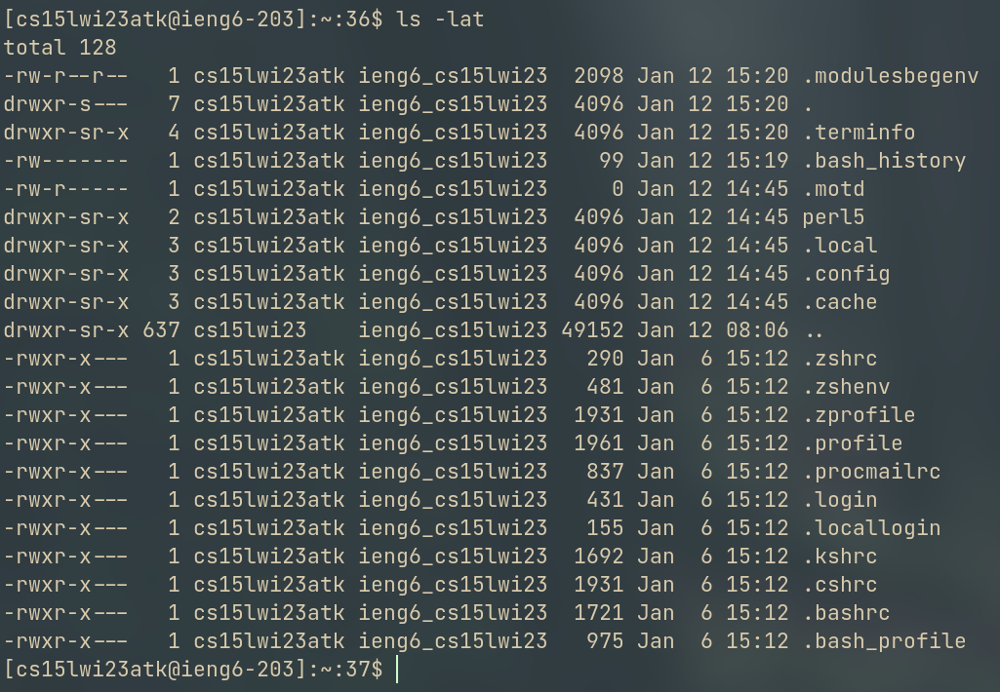

# Lab 1 Report

This lab report reivews the following:
- Installing Visual Studio Code
- Connecting to the university provided remote server
- Executing various commands in a shell to gain information on the system

## Installing Visual Studio Code

I already had Visual Studio Code installed on my system, for my personal
projects. However, it is fairly easy to install it. For most systems, the editor
can be downloaded [here](https://code.visualstudio.com/Download). Alternatively,
for Linux systems, VS Code can be installed via the command line using the
`snap` package manager:

```
$ snap install code --classic
```

After some customization, my editor now looks like this:


## Connecting to the Remote Server

Connceting to the UCSD remote server provided for this course was quite
painstaking. The password for the remote server must be manually reset on the
ETS page (submit credentials, navigate to the CSE 15L resources page, and click
on the link that lets you change the "Global Password"). After waiting a few
minutes (the average time is 15 minutes), one should be able to login to their
system with the password given during the reset procedure. What you see after
logging in should be similar to below:


## Trying Some Commands

Now we can finally try some commands:

```
$ ls # List items in the current directory/folder
```


```
$ whoami # List the current user (you!)
```


```
$ uptime # Show how many users are on the server
```


```
$ ls -lat # List ALL (even hidden) files in the folder, sorted by time
```


