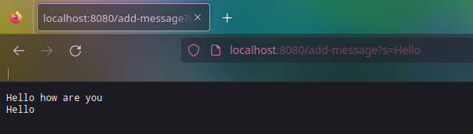

# Lab 2 Report

# Part 1: Implementing `StringSever`

To implement the `StringServer`, we use the server infrastructure given [in this
repository](https://github.com/ucsd-cse15l-f22/wavelet). As with the other
servers, the code to instatiate a server is:

```java
class StringServer {
	public static void main(String[] args) throws IOException {
		if(args.length == 0){
			System.out.println("Missing port number! Try any number between 1024 to 49151");
			return;
		}

		int port = Integer.parseInt(args[0]);

		Server.start(port, new Handler());
	}
}
```

Since our handler is dealing with string requests and queries, we should store a
list of strings that the user has requested to store. The resulting
`Handler`class is shown below:

```java
class Handler implements URLHandler {
	ArrayList <String> messages;

	public Handler() {
		messages = new ArrayList <String> ();
	}

	public String handleRequest(URI url) {
		if (url.getPath().contains("/add-message")) {
			String[] parameters = url.getQuery().split("=");
			if (parameters[0].equals("s"))
				messages.add(parameters[1]);
		}

		String response = "";
		for (String message : messages)
			response += message + "\n";
		return response;
	}
}
```

At the end of the `handleRequest` method, we combine all the strings the user
has entered, and print them onto the web page.

To compile this program, we simply compile with

```bash
$ javac StringServer.java
```
(don't forget to add the necessary imports; `java.io.IOException`;
`java.net.URI`; `java.util.ArrayList`) and then start the server with:

```bash
$ java StringServer 8080
Server Started! Visit http://localhost:8080 to visit.
```

**Examples of querying the server:**


In the above request -- `http://localhost:8080/add-message?s=Hello how are you` --
we server understands that the user wants to store the string `"Hello how are
you"`. The member `messages` in the server's `Handler` instance, which is
initially empty, is now append with this value.


In the above request -- `http://localhost:8080/add-message?s=Hello` --
we server understands that the user wants to store the string `"Hello"`.
The member `messages` in the server's `Handler` instance, which contained the
single element `"Hello how are you"` is now appended with `"Hello"` and these
two strings are printed as a result of the list containing both strings.

# Part 2: Bugs from the lab

We will focus on the `reverse` method implemented in the `ArrayExamples` class.
The initial test provided in the `ArrayTests` class passes without failure:

```java
@Test
public void testReversed() {
	int[] input1 = { };
	assertArrayEquals(new int[]{ }, ArrayExamples.reversed(input1));
}
```

However, the following test fails:

```java
@Test
public void testReversed2() {
	int[] input1 = {3};
	assertArrayEquals(new int[]{3}, ArrayExamples.reversed(input1));
}
```

The result of running of these tests with JUnit is shown below:


The first test has no symptoms. The second test procudes an incorrect output,
namely the array `{0}` when provided `{3}`.

Inspecting the initial code gives us insight into the problem:

```java
// Returns a *new* array with all the elements of the input array in reversed order
static int[] reversed(int[] arr) {
	int[] newArray = new int[arr.length];
	for(int i = 0; i < arr.length; i += 1) {
		arr[i] = newArray[arr.length - i - 1];
	}
	return arr;
}
```

Notice that the documentation for this method asserts that the method will
return a **new** array which is a reversal of the passed array. However, it is
returning `arr` instead of the `newArray`. Furthermore, inside the loop, we are
assigning elements of `arr` with those of `newArray` instead of vise versa.

The fixed code is as follows:
	
```java
static int[] reversed(int[] arr) {
	int[] newArray = new int[arr.length];
	for(int i = 0; i < arr.length; i += 1) {
		newArray[i] = arr[arr.length - i - 1];
	}
	return newArray;
}
```

And as shown, the test now run without failure:


# Part 3: Learning outcomes

In this lab, I learned how to use JUnit to explore the symptoms and failure of
my methods or programs in order to find bugs effectively. I had never used JUnit
before, so the idea of seamlessly running unit tests on methods was quite new to
me. I imagine that JUnit is a common industry practice, and that its application
has lead to a lot of saved bugs.
