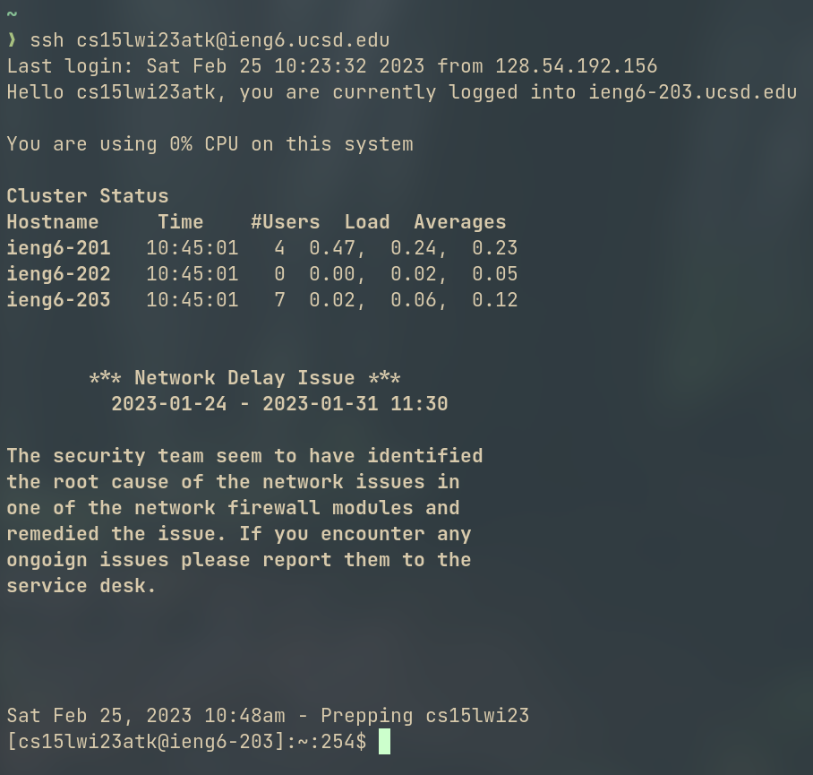
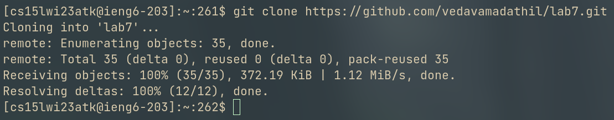
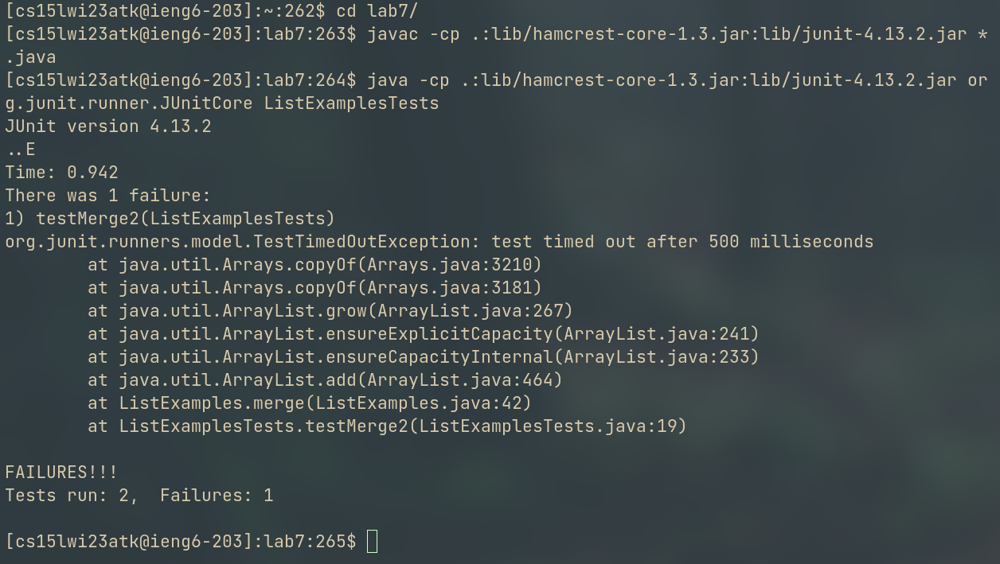
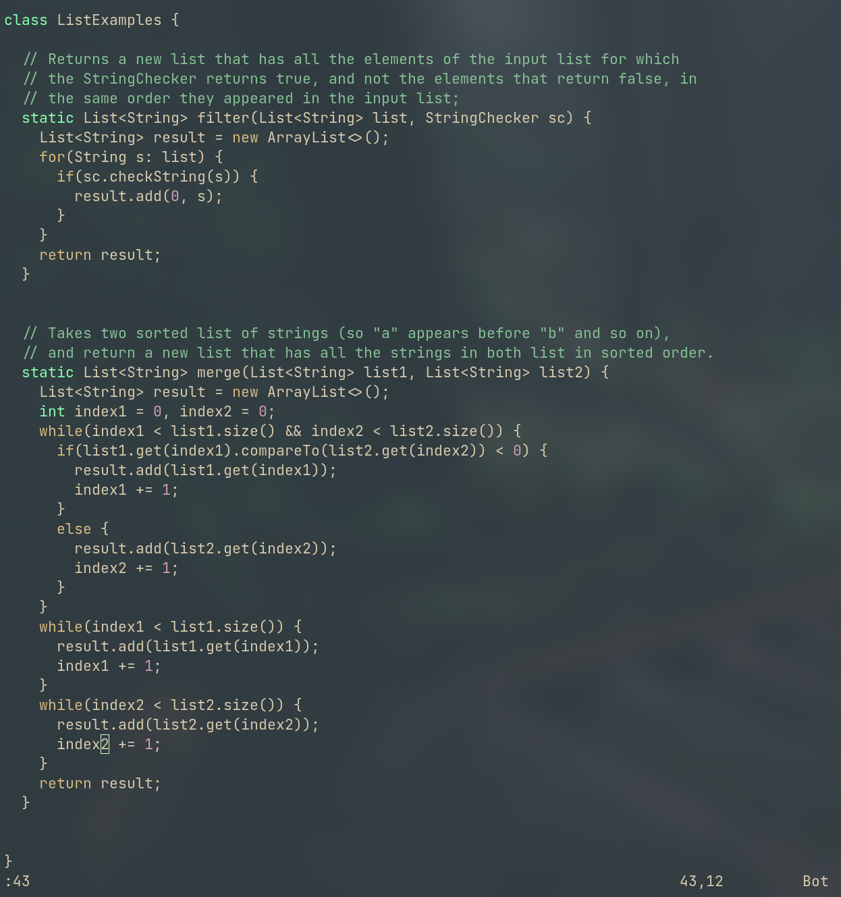
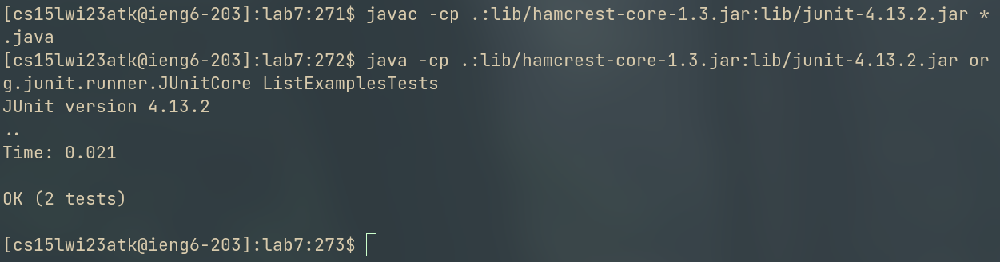
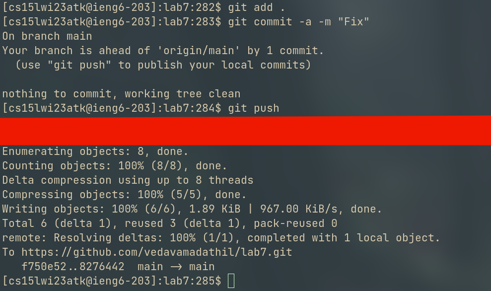

# Lab 4 Report

In this lab report, we will discuss the steps taken for the task we did in the
lab in more detail. Specifically, we will instruct how to complete steps 4
through 9 which are after the timer starts.

### Step 4: Log into ien6

This step is fairly trivial, in that there is not much to optimize. Simple type
`ssh cse15...@ieng6.ucsd.edu` as shown below:

In my case, my terminal hsa autocompletion, so typing out `ss` and pressing
`<right-arrow>` completed the command, after which I pressed `<enter>` to
execute the remote connection (I use a zsh terminal with an autocompletion
plugin).

### Step 5: Clone the forked repository

This cloning step is also fairly simple; I copied the URL of my forked
repository with `<cntrl-c>`, then went into the terminal, typed `git clone` and
pasted the URL with `<cntrl-shift-v>` (sometimes terminals will not respond to
the typical `<cntrl-v>`). The result is the following output:

### Step 6: Run the failing tests

To run the tests and show they fail, we need to compile the `java` files and
then run the JUnit tests. First, we change into the `lab7` forked directory: for
me, this meant typing out `cd`, and then `<l>` followed by `<tab>`, which
autocompleted the path to the forked repository.

To compile the code, we issue the command
`javac -cp .:lib/hamcrest-core-1.3.jar:lib/junit-4.13.2.jar *.java`,
which was easier in my case by pressing `<up-arrow>` 5 times in order to
retrieve the command from my history.

Similarly, to run the JUnit tests, we need to run the command
`java -cp .:lib/hamcrest-core-1.3.jar:lib/junit-4.13.2.jar
org.junit.runner.JUnitCore`, which was also around 5 commands up in the history.

The resulting output is shown below:

### Step 7: Edit the code and fix the issue

Next, we need to fix the code in order to get the tests to pass. I did this
using the `vim` command; in order to open the file, I typed `vim` and the letter
`<L>`, then `<tab>` to autocomplete to `ListExamples`, after which `<.>` and
`<tab>` again gave the desired command. Pressing `<enter>` now opened the file
in `vim`.

The fix occurs on line 43, where we need to change `index1` to `index2`. To
perform this fix in `vim`, we will first go to this line. Typing `<esc>` enables
command mode, where now typing `:43` brings our cursor to the beginning of the
`index1` token. We can be optimal with our keys; instead of repeated
`<right-arrow>`, then entering insert mode with `<i>` and deleting the character
and typing a new one, we do the following: pressing `w` brings the cursor to
after the `index1` token, and pressing `<left-arrow>` twice brings our cursor
right on top of the `1`. Then, we can enter replace mode with `<r>` and press
`<2>` to replace the character. Now our fix is made, and all that remains is to
save and exit, with `<esc>`, and then `:x<enter>`.

The this is what the editor looks like before saving and exiting:

### Step 8: Run the tests again

Now we have to run the tests again, which is simple using the command history
features of bash. By pressing `<up-arrow>` until the appropriate commands showed
up, I ran the `javac ...` and `java ...` commands, yielding the following
outputs:

### Step 9: Commit and push the changes

To update the repository with the changes we made, we need to `git add` all the
changes, then `git commit` with a message and finally `git push` to the remote
repository.

To add (stage) the changes, I simply typed `git add .` (the `.` adds every
change for committing). Next, I commit the changes with `git commit -m "Fix"`;
the `-m` field allows us to specify the commit message without needing to open
an editor, which simplifies things for us. Finally, issuing the `git push`
command will push the commit to the remote repository.

The output of these commands is show below (ignore the commit warning, and the
red line; some private credentials had to be used for my account):

